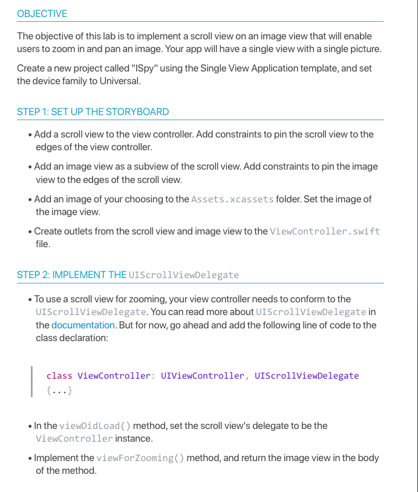
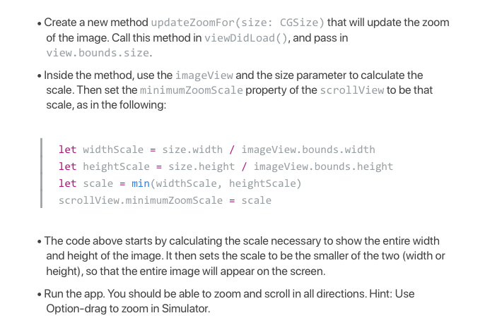

## CIS-444
Lecture-21: HW Exercise

* 🛑 Complete [Guided Lecture-21](https://github.com/SyracuseUniversity-CIS444/CIS-444/blob/master/Lectures/L21-1-UIScrollViews/lecture.md) 
* ✏️ Complete the following to me `RCSlatki@syr.edu` by class **this** `Wednesday April 8, 2020`

Great work! You've made an app that can scroll and zoom in on an image. 
✏️Can you think of something you want to build where this functionality might be useful? (include your answer in your  submission)
