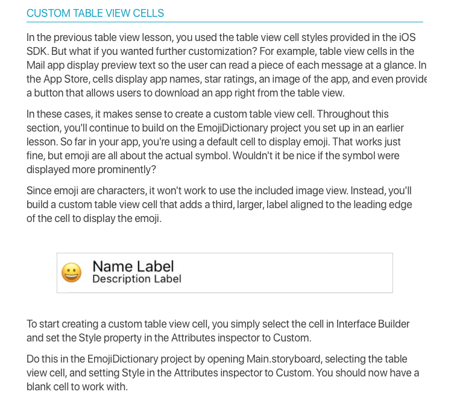
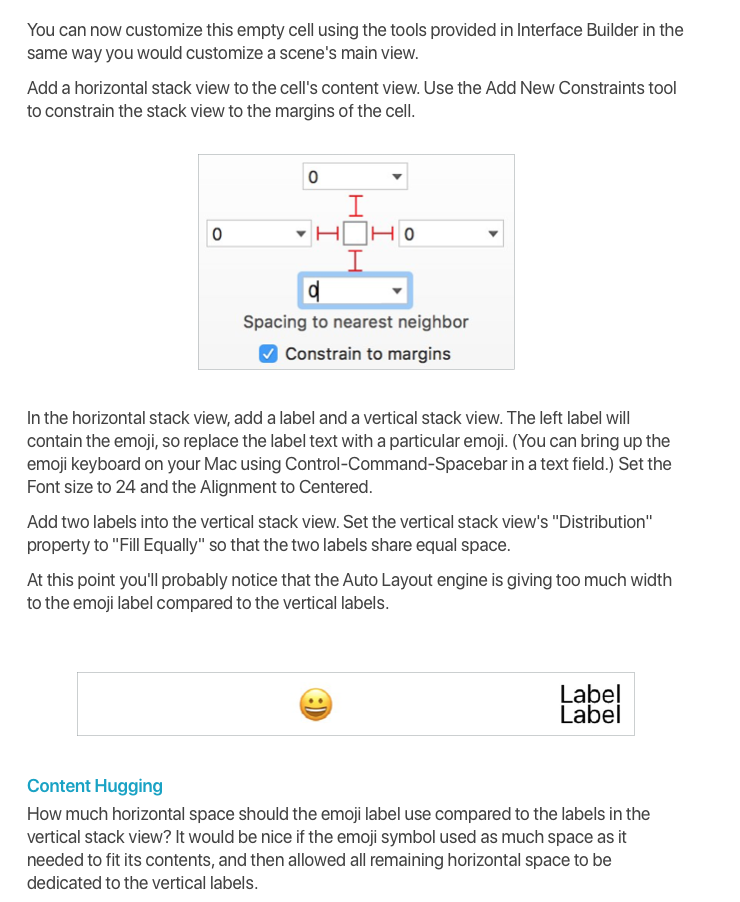
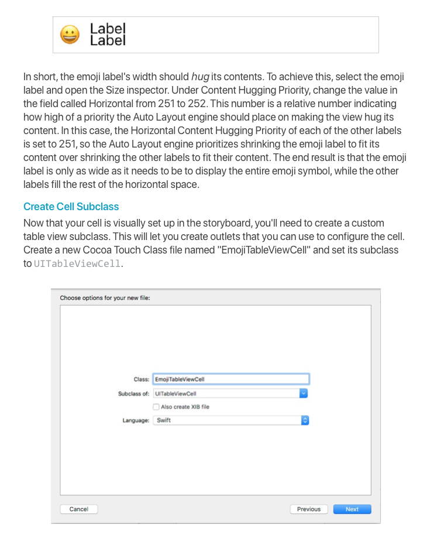

# CIS-444
## Exercise 23: Exercise Intermediate Table Views

* ✏️ Complete and submit to `RCSlatki@syr.edu` ( assignments accepted until `Monday April 20, 2020`)

The objective of this lab is to implement intermediate table view features into an app that keeps track of your favorite books.

You'll find a starter project called "FavoriteBooks" [here](https://www.dropbox.com/s/9f324pkp28cop0d/FavoriteBook.zip?dl=0). Download it and take a minute to look it over. You'll notice that it contains a table view controller that segues to a regular view controller. The regular view controller contains a form that allows the user to enter details about a book. In this lab, you'll replace the form with a static table view, add the capability to delete books from the main list of books, and create a custom table view cell to better display the details of each book in the main list.

