# CIS-444
Lecture 24: Persistence

* ✏️ Complete and submit to `RCSlatki@syr.edu` ( assignments accepted until `Monday April 20, 2020`)

Earlier in this unit, you learned how the MVC architecture helps you separate the roles of data, views, and the helper objects that communicate between them. In almost all cases, data is extremely important to your users. If they enter information into an app, they expect it to persist, or continue to exist, within the app—even after the app has closed.
In this lesson, you'll learn how to persist data using Codable, a protocol you learned about in a previous lesson.

What You'll Learn:
* How to write and access files in your app's Documents directory
* How to serialize model data to a format that can be saved
* How to serialize saved data to model data that can be used in the app

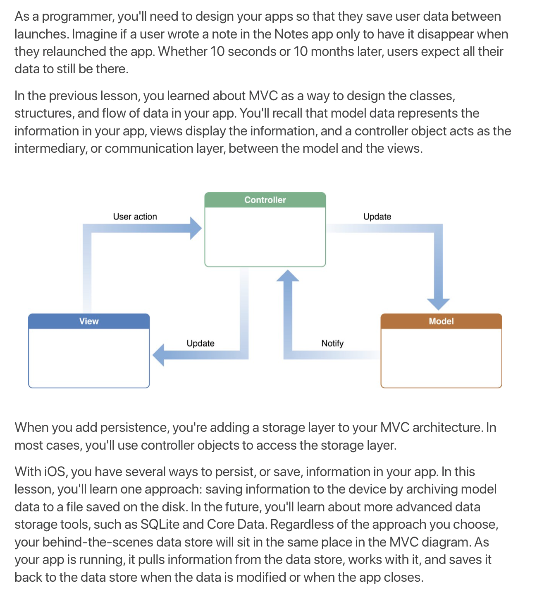
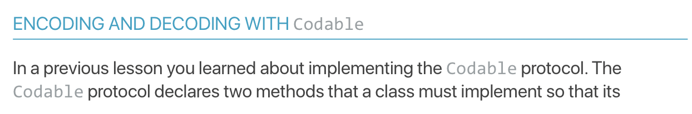
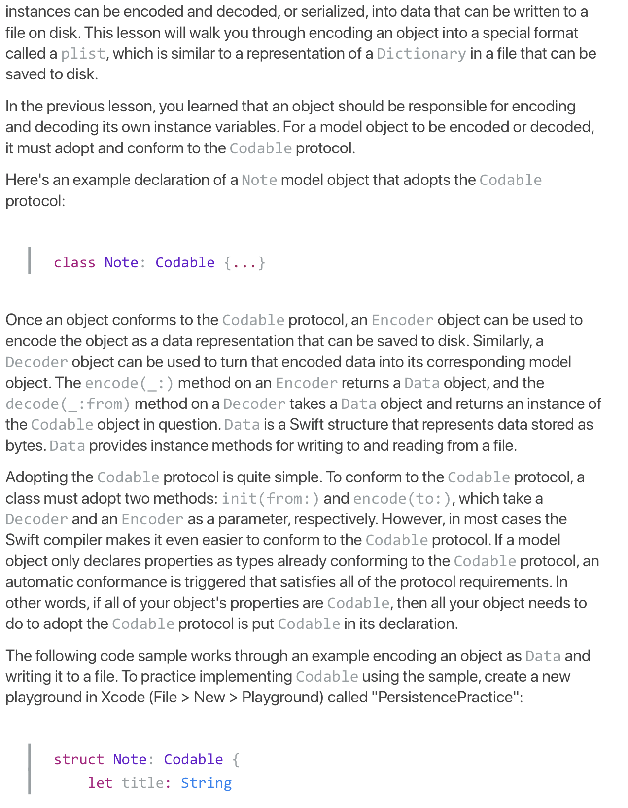
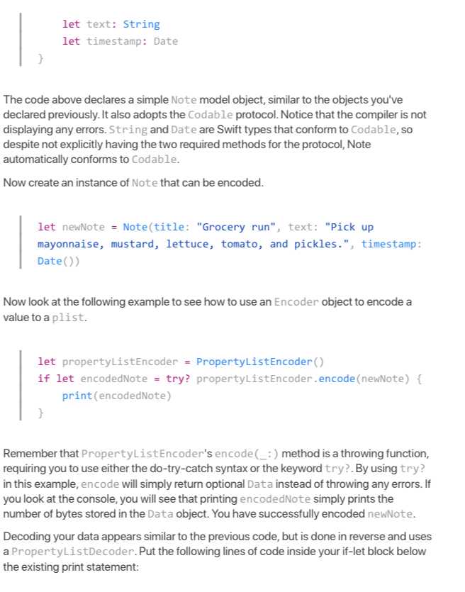
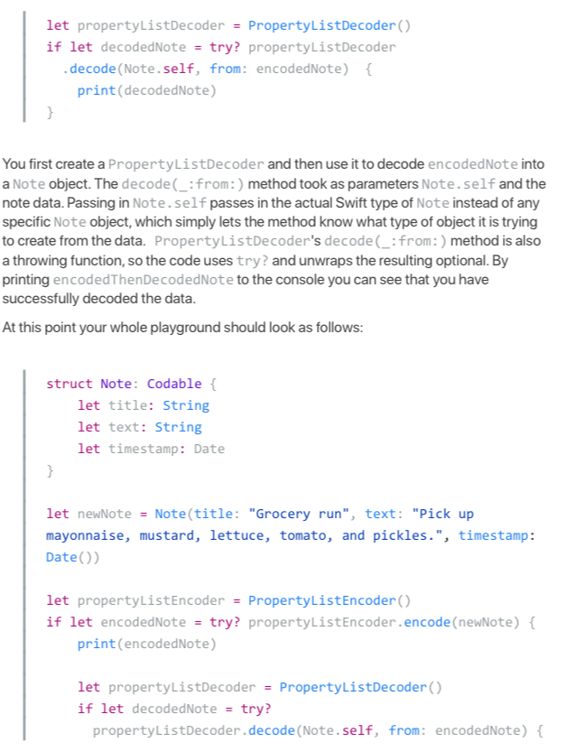
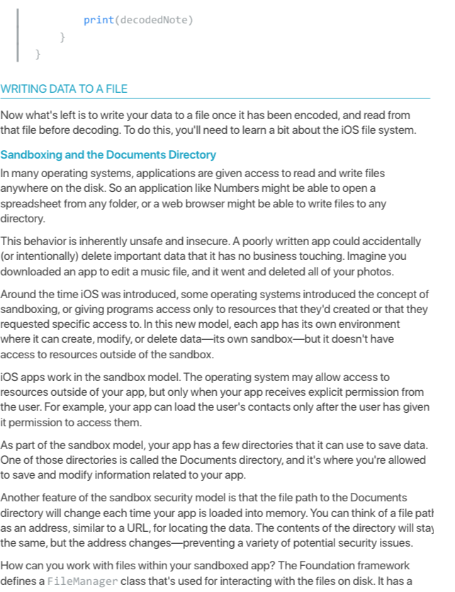
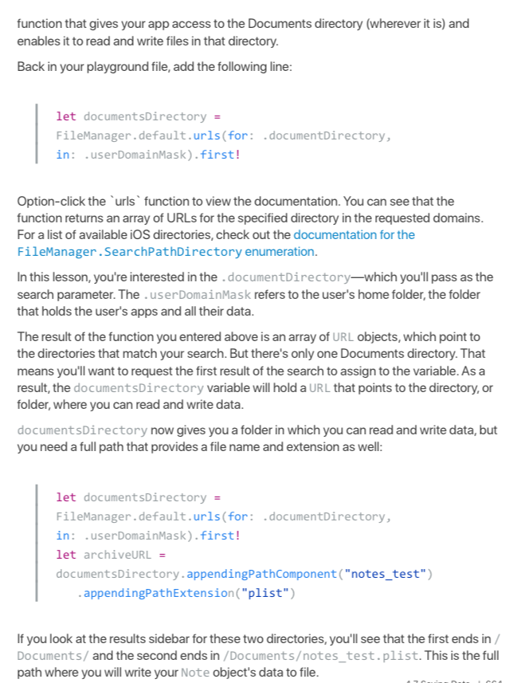
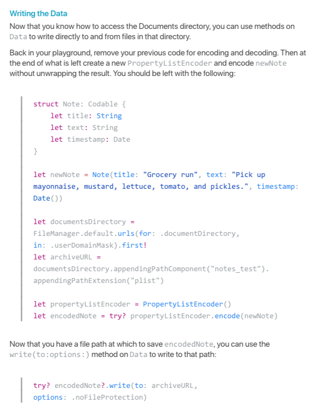
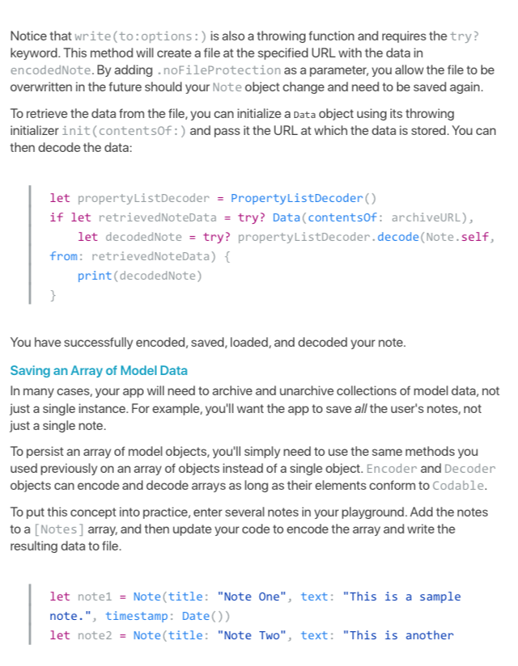
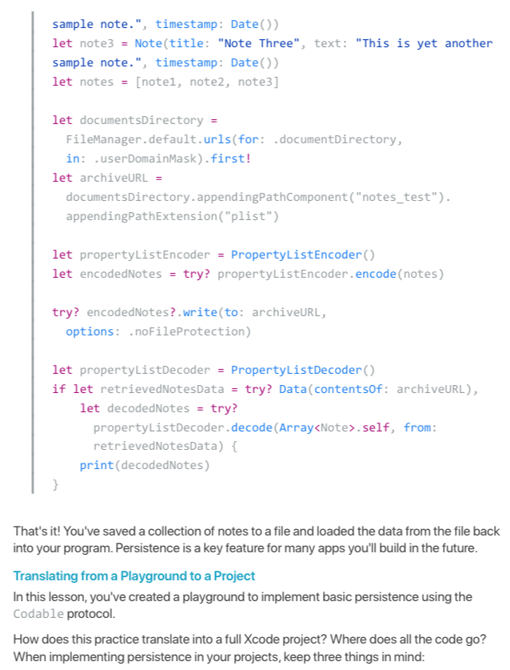
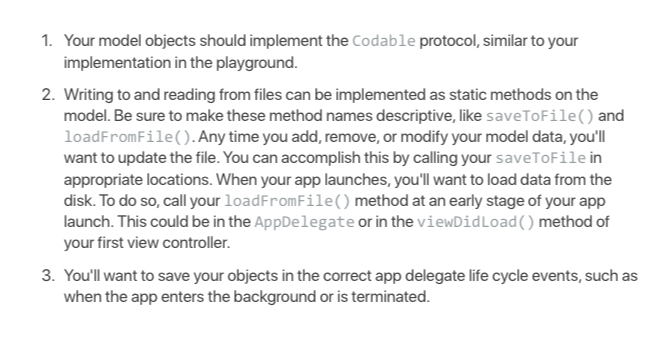

