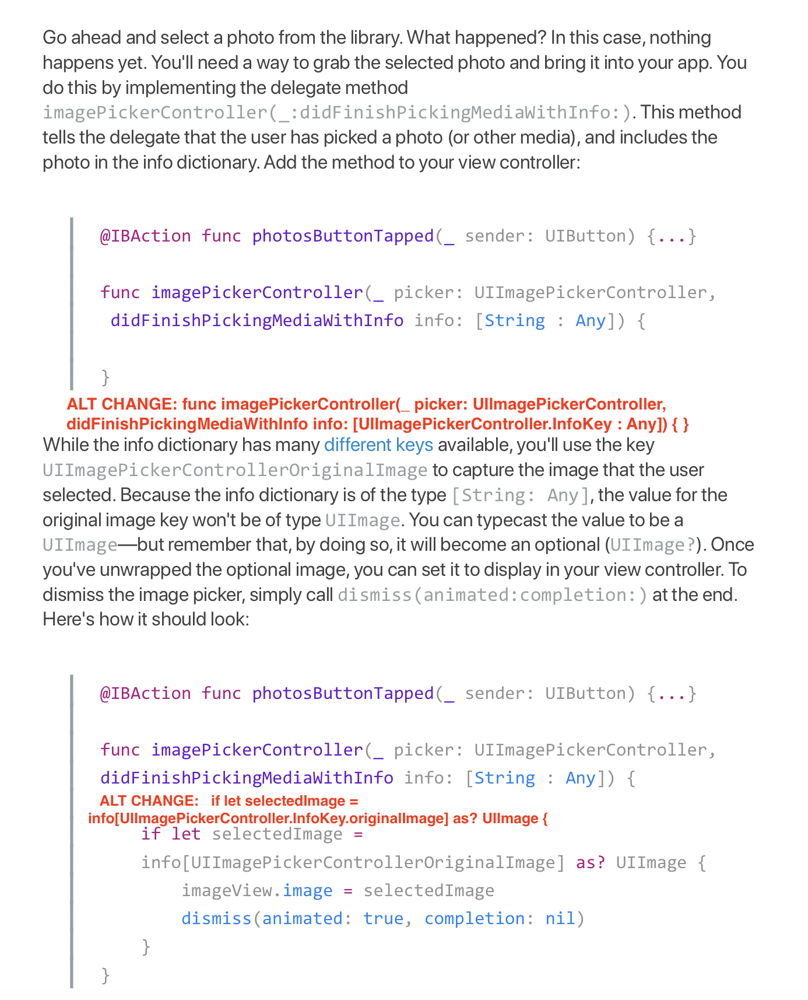

# CIS-444 
## Lecture 25: System View Controllers

* Email `RCSlatki@syr.edu` due by `WEDNESDAY, April 22, 2020` 

* BEFORE YOU BEGIN: Download the starter project [here](https://www.dropbox.com/s/yr0bbxr2bcwadf1/HomeFurniture.zip?dl=0)

Up to this point in the course, you've been making your own subclasses of UIViewController to display information in your apps. But UIKit includes a number of UIViewController subclasses that make it easy for you to present, access, and share app content.
In this lesson, you'll learn how to incorporate these system view controllers for displaying alerts, sharing content, sending messages, and accessing the camera and photo library on an iOS device.

### What You'll Learn

* How to present and respond to actions in an alert controller
* How to present an activity controller
* How to present a mail compose view controller
* How to access and respond to selections in an image picker
* How to present a Safari view controller

