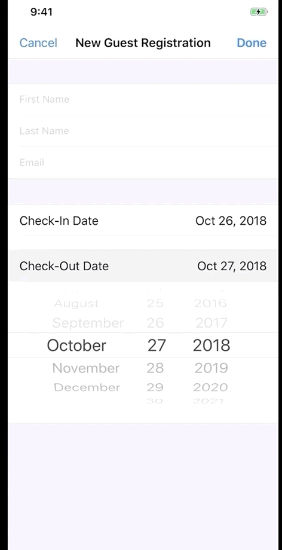
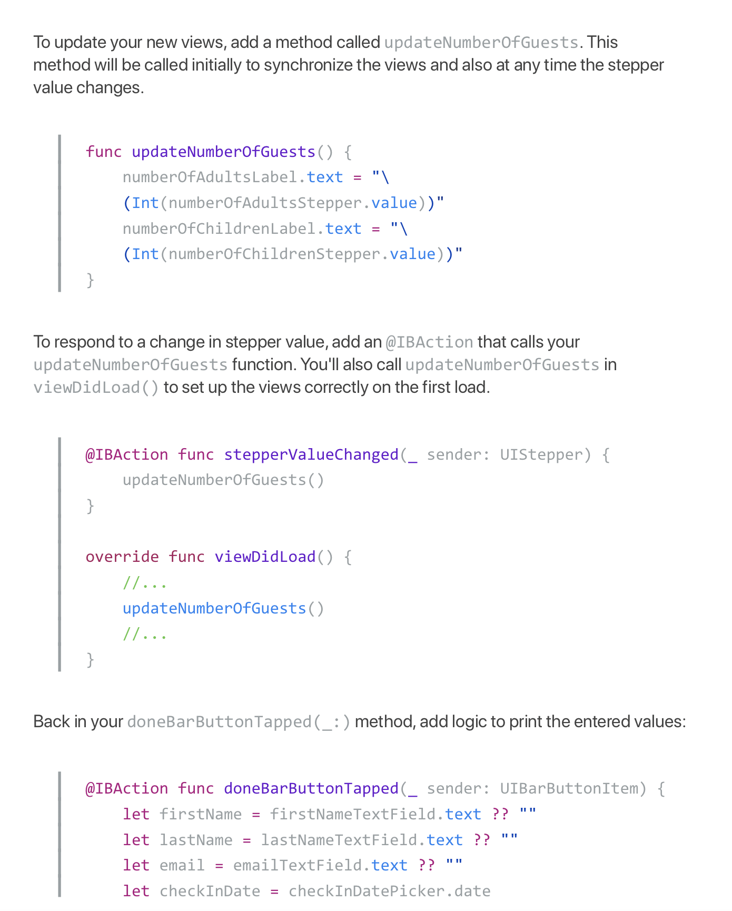

# CIS-444
## Lecture 26: Building Complex Input Screens

* Complete and email to me `RCSlatki@syr.edu` by  `Monday, April 27, 2020`

### Building Complex Input Screens

If you're an iOS user, you know that the App Store offers many great apps for download. You're probably familiar with games, social media apps, and other apps that make your life easier or more fun. But the App Store also offers apps that help businesses track, record, and monitor their day-to-day activities. Whether they're recording daily safety inspections for a city transit system, customer orders, or hotel guests, these apps have complex screens that allow users to input data for storage and management.

In this lesson, you'll learn how to combine multiple controls and views to build custom and complex user input workflows.

### What You'll Learn
* How to build custom forms to create new model objects or for entering data
* How to use custom protocols to pass data between view controllers
* How and when to use certain controls for collecting data
* How to dynamically resize table view cells

